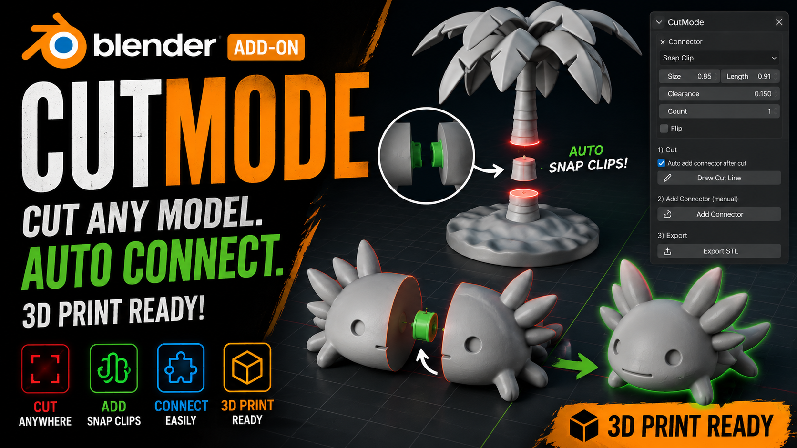

# CutMode

> **The fastest way to prepare 3D models for printing directly inside Blender.**

Split your models, automatically generate snap-fit connectors, and export printable STL files in seconds.

---

# 🎥 Demo Video

👉 **Watch the full demonstration on YouTube**

https://youtu.be/wIgf0kG3_RM

---

# ✨ Features

- ✂️ Cut any model anywhere
- 🟢 Automatically add Snap Connectors
- 🔧 Manual Connector Tool
- 📏 Adjustable Connector Size
- 📐 Adjustable Clearance
- 🔢 Multiple Connectors
- 📦 Export directly to STL
- ↩️ Undo Last Cut
- 🖨️ Designed specifically for 3D Printing
- ⚡ Fast and non-destructive workflow

---

# 🚀 Why CutMode?

✔ Split large models in seconds

✔ Automatically generate printable snap-fit connectors

✔ No external STL splitting software required

✔ Works directly inside Blender

✔ Perfect for FDM & Resin printing

✔ Saves hours of manual work

---

# 📥 Installation

1. Download the latest release from the **Releases** section.
2. Open **Blender**.
3. Go to **Edit → Preferences → Add-ons**.
4. Click **Install...**
5. Select **CutMode.zip**
6. Enable **CutMode**

---

# 🖼 Preview

More screenshots and tutorials will be added soon.

---

# 🛣 Roadmap

## Completed

- ✅ Interactive Cutting Tool
- ✅ Automatic Snap Connectors
- ✅ Manual Connector Tool
- ✅ STL Export
- ✅ Adjustable Connector Settings
- ✅ Undo Last Cut

## Coming Soon

- ⏳ Magnet Connectors
- ⏳ Dovetail Connectors
- ⏳ Puzzle Connectors
- ⏳ Pin Connectors
- ⏳ Batch Cutting
- ⏳ More Connector Types
- ⏳ Performance Improvements

---

# ❤️ Support

If you enjoy CutMode, please consider:

⭐ Starring this repository

📺 Watching the YouTube tutorial

🐞 Reporting bugs and suggesting new features

Your feedback helps improve CutMode for everyone!

---

# 📄 License

MIT License
